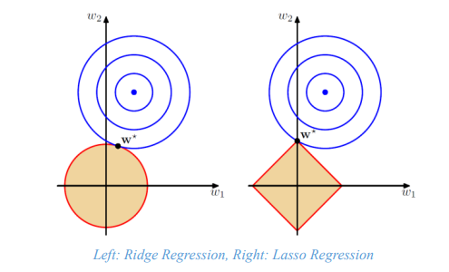

# Machine Learning Theory Q/A
---

## 1. What is a labelled training set?

- Training set is the dataset that we use for training a ML model, i.e., it is used to find the parameters of the model
- Labels are the desired output from the supervised learning task that we perform
- A labelled training set contains the input and the desired output

---

## 2. What is a test set and validation set?

- The entire data is split into train and test set
- The train set is further split into train and validation set
- Validation set is used to tune hyperparameter and perform model selection
- Test set is used to evaluate the trained model's generalization errors
- Test set should never be used to learn parameters or tune hyper-parameters

---

## 3. What is the problem of using test set for hyper parameter tuning?

- The model may overfit the training data
- You will not have a good estimate of the model's performance in unseen data
- You will be overconfident about your model and will be disappointed in deployment performance

---

## 4. What are the two most common supervised tasks and four most common unsupervised tasks?

- **Supervised:** Regression, Classification
- **Unsupervised:** Clustering, Density Estimation, Anomaly Detection (or Novelty Detection), Dimensionality Reduction

---

## 5. What kind of ML algorithm is used by a robot which explores a region and learns to walk?

- Reinforcement Learning is the most natural framework to use here.
- Under some conditions, you may be able to formulate the problem as a supervised or semi-supervised learning approach. But in most cases this approach is not natural.

---

## 6. What algorithms are suitable for customer segmentation?

- The most ideal algorithm, especially if it is a new area the business is entering, is active learning or semi-supervised algorithms.
- If we do not know the segments of some datapoints for customers (e.g., geography, demography, behavior, technography, psychography – attitudes, belief etc), i.e., we do not have a labelled dataset, then use an unsupervised clustering algorithm
- If we know labels of a "good" dataset, then use supervised classification algorithm
- If we need to label some data points to get a "good" labelled set, and have limited resources (money, time, manpower), then use a semi-supervised approach with label propagation

---

## 7. Contrast online and offline learning systems including the nuances.

- An online learning system incrementally updates the model (i.e., the parameter values) with new data points.
- An offline learning system updates the model (i.e., the parameter) only in the training phase
- Typically, online system means "online" during deployment.
- However, an offline algorithm (Stochastic gradient descent for linear regression) is also an "online" algorithm in that it incrementally updates the model with new data points.

---

## 8. Contrast instance based and model-based learning

- **Instance based learning** just looks at the similarity between a new data point and the training set, to decide the label of the new data point
  - Example: k-NN
- **Model based learning** looks at the training data set and creates a learning representation of the data, i.e., it learns the model between the input and output in terms of mathematical equations (or computer algorithms)
  - Example: Linear Regression, Decision Trees, Neural Networks

---

## 9. Contrast model parameters and hyperparameters

- **Parameters:** variables in the model that must be found from data using a learning (or optimization) algorithm
- **Hyperparameters:** variables that are set by users before learning from data. Hyper parameters are also chosen from data but by a cross validation, or search approach. Research is ongoing to find a definitive hyperparameter optimization algorithm that scales well. Bayesian Optimization is a promising approach in this space.

---

## 10. List the six steps that we discussed as part of the ML process.

1. **Frame the ML problem** by looking at the business need
   - Identify subproblems
2. **Gather the data and do Data Munging/Wrangling**
   - Explore the data
   - Clean data and prepare for the downstream ML models
3. **Explore different models**, perform V&V and shortlist promising candidates
4. **Fine-tune shortlisted models** and combine them together to form the final solution
5. **Present your solution**
   - Say a story with the data
6. **Deploy**

---

## 11. What is the tech-stack that is needed for the ML process?

1. **Frame the ML problem** by looking at the business need
2. **Gather the data and do Data Munging/Wrangling** for each subproblem
   - **Pandas, Numpy, Seaborn, Matplotlib**
   - **sklearn.preprocessing** (scaler, OneHotEncoder), **sklearn.impute** (data cleaning, drop nan etc), custom transformers
3. **Explore different models**, perform V&V and shortlist promising candidates
   - **sklearn.pipeline, sklearn.model_selection, sklearn.xxx** (where xxx is a model), **XGBoost, TF2, Keras**
4. **Fine-tune shortlisted models** and combine them together to form the final solution
   - **sklearn.ensemble.VotingClassifier** etc.
5. **Present your solution**
   - **PowerPoint, Seaborn, matplotlib, plotly, dash, javascript** (fusion charts, react, d3), Special Packages/Software **(Tableau, Power BI)**
6. **Deploy**
   - **Google Cloud Platform, AWS SageMaker**

---

## 12. What is Recall, Accuracy, F1 Score?

| | True Label + | True Label − |
|---|---|---|
| **Pred. Label +** | True Positive (TP) | False Positive (FP) |
| **Pred. Label −** | False Negative (FN) | True Negative (TN) |

**a. Precision** = TP / (TP + FP)

- Among all predictions of Label A, how many are actually Label A
- Trivial 100% Precision – Make only one Prediction of Label A, and ensure that it is correct. Then TP=1, FP=0, and Precision=1

**b. Recall** = TP / (TP + FN)

- Of all true Label A, how many does our classifier predict as Label A
- Combined with Precision, we now have a good sense of the goodness of our classifier

**c.** Typically, we want high precision and high recall

**d. F1 Score** = 2 / (1/precision + 1/recall) = TP / (TP + (FN + FP)/2)

**e.** There are other F2, Fhalf scores, that give different weights to precision and recall while calculating the harmonic mean.

---

## 13. Which Linear Regression training algorithm should be used when there is a dataset with millions of features?

- SGD, Mini-Batch Gradient Descent are the appropriate for this use case
- Normal equation solution doesn't work as computational cost grows more than quadratically with features

---

## 14. Can gradient descent get stuck in a local minimum for Linear Regression? What about Logistic Regression?

It will not get stuck in both cases as the objective function (i.e., loss function) is convex in both the cases.

---

## 15. Is it a good idea to stop mini-batch gradient descent immediately when the validation error goes up?

No. As both SGD and mini-batch are stochastic in nature, they are not guaranteed to make progress at every iteration. So there can be iterations in which the validation error goes up even though the optima has not been found due to this random nature.

---

## 16. Consider the hypothetical situation in which validation error is much higher than the training error. What may be the reason? State some ways to solve this issue.

If the validation error is much higher than the training error, this is likely because your model is overfitting the training set. Ways to fix it:

1. **Reduce the polynomial degree:** a model with fewer degrees of freedom is less likely to overfit.
2. **Regularize the model** by adding an l2 penalty (Ridge) or an l1 penalty (Lasso) to the cost function.
3. **Increase the size of the training set.**

---

## 17. When to use Plain, Ridge, Lasso, Elastic Net Regression?

- A model with some regularization typically performs better than a model without any regularization, so you should generally prefer **Ridge Regression** over plain Linear Regression.
- **Lasso Regression** uses an l1 penalty, which tends to push the weights down to exactly zero. This leads to sparse models, where all weights are zero except for the most important weights. This is a way to perform feature selection automatically, which is good if you suspect that only a few features actually matter. When you are not sure, you should prefer Ridge Regression.
- **Elastic Net** is generally preferred over Lasso since Lasso may behave erratically in some cases (when several features are strongly correlated or when there are more features than training instances). However, it does add an extra hyperparameter to tune. If you want Lasso without the erratic behavior, you can just use Elastic Net with an l1_ratio close to 1.

---

## 18. Suppose you are using Ridge Regression and you notice that the training error and the validation error are almost equal and fairly high. Would you say that the model suffers from high bias or high variance? Should you increase the regularization hyperparameter α or reduce it?

If both the training error and the validation error are almost equal and fairly high, the model is likely **underfitting** the training set, which means it has a **high bias**. You should try **reducing** the regularization hyperparameter α.

---

## 19. Why is correlation between features and target variables important in regression? Show it mathematically.

$$
(X^T X)\theta^* = (X^T y)
$$

$$
\frac{1}{m}(X^T X)\theta^* = \frac{1}{m}(X^T y)
$$

$$
C_{XX}\theta^* = C_{Xy}
$$

$$
\theta^* = C_{XX}^{-1} C_{Xy}
$$

If $C_{Xy}$ is zero, the coefficient of that feature in the linear model is zero. This implies that feature is not contributing to the prediction.

---

## 20. Write the objective function for ridge regression problem. Set its first derivative equal to zero and write the closed form solution.

$$
(X^T X)\theta^* = (X^T y)
$$

$$
\frac{1}{m}(X^T X)\theta^* = \frac{1}{m}(X^T y)
$$

$$
C_{XX}\theta^* = C_{Xy}
$$

$$
\theta^* = C_{XX}^{-1} C_{Xy}
$$

When $X^T X$ is rank deficient, its condition number is bad and finding a solution is not stable. Adding α to the diagonals helps improve the condition number and helps in finding a solution.

---

## 21. Draw a figure to show the difference between ridge regression and lasso regression



```
Ridge Regression (L2)          Lasso Regression (L1)
        w₂                              w₂
        |                               |
    (circular                       (diamond
   contours)                        contours)
        |                               |
   ─────────── w₁                ─────────── w₁
   
  Constraint region:            Constraint region:
  w₁² + w₂² ≤ t                |w₁| + |w₂| ≤ t
  (ball/circle)                 (rotated square/diamond)
```

> **Left: Ridge Regression** — The circular constraint region means the optimal point (intersection of loss contours and constraint) rarely falls exactly on an axis, so weights are shrunk but not set to zero.
>
> **Right: Lasso Regression** — The diamond-shaped constraint region has corners on the axes, so the optimal point frequently falls at a corner, driving some weights to exactly zero (sparse solution).

*(Original figure from Bishop, Pattern Recognition and Machine Learning)*

---

## 22. In classification problems, do we generally use the same loss function as the evaluation function?

- **No.** In classification, the evaluation metrics such as Recall, Precision, F1 Score are not differentiable and not good to be used as an objective function to learn model parameters
- So, we prefer to use differentiable and nicely behaved functions such as **cross entropy, log loss** to train the model, but use Recall, Precision, F1 Score, AUC to evaluate the model.

---

## 23. What is the loss function used for multilabel classification?

Either binary classification with **1 vs rest** approach or a **softmax regression** linear model can be used.

---

## 24. Explain the concept of entropy with an example

- Take an example of weather forecast with 4 labels (sunny, sun+cloud, rain, rain+thunder)
- We can encode the above using 2 bits as 2² = 4: `00` – Sunny; `01` – Sun+Cloud; `10` – Rainy; `11` – Rain+Thunder
- Now, let us say that with 90% probability, the forecast is sunny, then a more efficient encoding scheme is to reserve one bit for sunny, and then two more bits for the above encoding.
- So in 90% of the time, only 1 bit needs to be sent, and only 10% needs 3 bits. So overall, we send on an average 0.9×1 + 0.1×3 = **1.2 bits**, which is lower than 2 bits needed earlier
- This happened because we have an assumption about the distribution of the information.
- **Entropy measures the average number of bits you actually send per option**
- Entropy is defined for a probability distribution p(x) as:

$$
H(p) = -\sum p(x) \log p(x)
$$

---

## 25. What is Cross Entropy?

- Cross entropy is defined as a measure of difference between two probability distributions defined over the same set of elementary events.

$$
H(p, q) = -\sum p(x) \log q(x)
$$

- It is used as a **loss function for classification tasks**.
- The concept is linked to the entropy of p(x) and the **Kullback-Leibler divergence** between p and q, which is the information theory measure of the distance between two probability distributions.
- For continuous RV, the above summation becomes an integral.

---

## 26. Which probability distribution has the maximum entropy?

- **Uniform distribution** has the maximum entropy
- Any other structured distribution such as Gaussian (Normal), GMM, Erlang, Binomial etc are more structured and more informative than Uniform distribution.
- All these distributions have a lower entropy than Uniform

---

## 27. How deep is a decision tree trained without restriction on a dataset of size m?

- **m**
- This DT will overfit the training data

---

## 28. Suppose a decision tree is overfitting, will scaling the features help? Will scaling help if the tree is underfitting?

- **No.** Scaling of features in decision tree has no impact on performance
- The good thing about Decision trees is that they can work with multiscale data

---

## 29. What type of decision boundaries do decision trees produce?

A decision tree produces **orthogonal decision boundaries** on the feature space.

---

## 30. Explain how a decision tree regression can overfit.

A decision tree with sufficient depth can have a tree in which each leaf corresponds to individual entries of the training data leading to **zero (or near zero) training error**.

---

## 31. What are some hyperparameters to change to induce regularization in decision trees?

`min_samples_leaf`, `max_depth` *(others are also possible)*

---

## 32. Name two common criteria that can be used in the objective function of node splitting of a decision tree.

- **Gini Impurity, Entropy**
- In most practical situations, both the criteria lead to similar trees. Gini is faster to compute so it is a good default. In datasets when the two trees (one with Gini and other with Entropy) differ, Entropy tends to produce more balanced trees than Gini.

---

## 33. What does it mean to regularize nonparametric models such as decision trees?

For non-parametric models, the meaning of regularization is to **reduce the model's degrees of freedom** such that it does not overfit the training data and generalizes well beyond what training data says.

---

## 34. Write the Gini impurity at a node of the decision tree and the CART classification optimization objective function at a node

**a. Gini Impurity:**

$$
G_i = 1 - \sum_{k=1}^{n} p_{i,k}^2
$$

where *i* is the node, *k* is the index that runs through all the classes.

**b. CART Optimization Objective:**

$$
J(k, t_k) = \frac{m_{left}}{m} G_{left} + \frac{m_{right}}{m} G_{right}
$$

where *k* is the feature and *t_k* is the threshold on that feature, *G* is the Gini impurity in the left and right children, *m* is the number of training instances left in those nodes.

---

## 35. How to determine the probability of belonging to a class at a node in the decision tree?

At every node, count the number of training instances and the decision on them made by that node based on its criteria. The **ratio** gives the probabilities of the class at that node.

---

## 36. What are the different types of ensemble learning schemes?

**Bagging, Boosting, Stacking**

---

## 37. Distinguish between hard and soft voting ensemble classifiers.

- In **hard voting** classifier, the majority vote is used
- In **soft voting** classifiers, the probability of each classifier is used to give the final vote

---

## 38. What is out-of-bag evaluation? Why is it useful?

- Out-of-bag evaluation is a strategy in which each predictor in a bagging ensemble is evaluated using instances that it was **not trained on**.
- OOB gives an **unbiased evaluation** of the ensemble without requiring an additional validation set for evaluation. Thus, more instances are available for training, and hopefully that leads to better training.

---

## 39. If AdaBoost is underfitting, which hyperparameters should be tuned?

- Increase the number of estimators
- Reduce the regularization
- Increase the learning rate

---

## 40. In what direction must learning rate be tweaked to avoid overfitting by a Gradient Boosting ensemble?

- **Decrease** the learning rate
- Use **early stopping** so that more than required features are not added

---

## 41. What is a Random Forest?

A random forest model is a **bagging ensemble of decision tree models**.

---

## 42. How can feature importance be calculated in Random Forests?

- In Random Forests, the importance of a feature can be computed by looking at the **weighted average of impurity reduced** by nodes that use a certain feature
- This weighted average can be converted to a score between zero and one by **normalizing** over all features

---

## 43. Distinguish between bagging and pasting ensemble schemes

- In **Bagging**, the multiple ensemble members (estimators) are trained with **sampling with replacement**
- In **Pasting**, the multiple ensemble members (estimators) are trained with **sampling without replacement**

---

## 44. Comment on the computational scalability of Boosting, Bagging, Pasting, and Random Forests

- **Bagging, Pasting** and (hence) **Random Forests** are scalable algorithms that can be trained on parallel and distributed machines since each estimator is independent of the other
- **Boosting** is necessarily a **sequential process** that cannot be scaled by distributing individual estimators across machines

---

## References and Acknowledgements

1. *Hands-On Machine Learning with Scikit-Learn, Keras, and TensorFlow*, 2nd Edition by Aurélien Géron. Publisher(s): O'Reilly Media, Inc.
2. Figure as answer to Question 21 is from Bishop